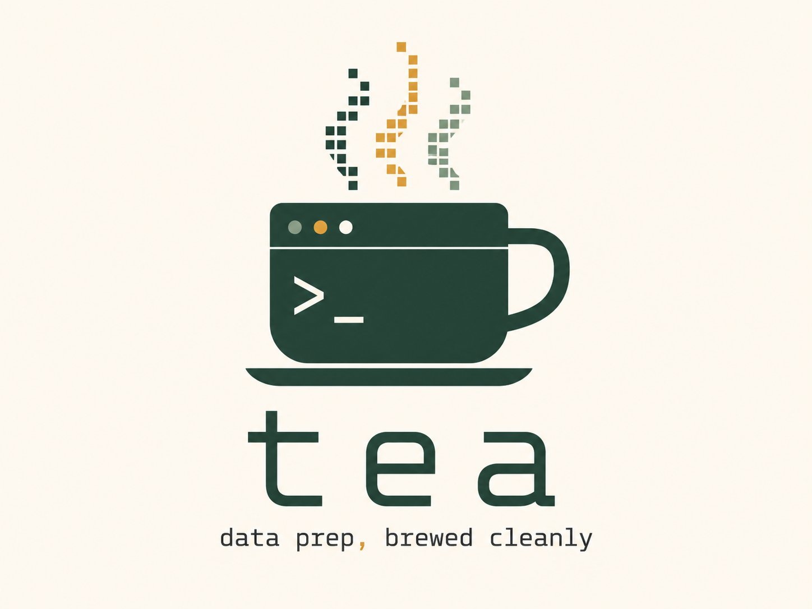

<p align="center">
  
</p>

# tea — tiny econometric assistant

*Data prep, brewed cleanly.*

A small C17 program for the data-prep phase economists use Stata for: import,
clean, define variables, prepare for econometrics. Interactive REPL plus batch
do-files for repeatability. Deliberately *not* pandas — the syntax is close to
Stata's and the semantics are faithful where it matters.

> tea is an independent open-source project.  It is not affiliated with,
> endorsed by, or sponsored by StataCorp LLC.  *Stata* is a registered
> trademark of StataCorp LLC.

## What tea v1.0 does

**Data manipulation**:

| Area                    | What works |
|-------------------------|------------|
| File I/O                | `.dta` (Stata-native, full round-trip of types, formats, var labels, value labels), `.tea` (native binary), `.csv`/`.tsv` (RFC 4180 quoting), `.xlsx`/`.ods` (via LibreOffice headless) |
| Variable creation       | `generate`, `replace` (with `by:`, `if`, `in`), `egen` (mean/sum/total/count/min/max/sd/group/rowtotal/rowmean/...) |
| Type conversion         | `encode`, `decode`, `destring`, `tostring`, `recode` |
| Reshape & merge         | `reshape long|wide` (in-place), `merge 1:1|m:1|1:m` (m:m rejected), `collapse` |
| Calendar                | `mdy`, `ym`, `yq`, `yw`, `yh`, `dofm`/`mofd`/..., `%td`/`%tm`/`%tq`/`%tw`/`%th`/`%ty` formats, `date(...)` parser |
| Macros & control flow   | `` `local' `` and `$global`, `r()` and `e()` references, `foreach`, `forvalues`, `if`/`else`, `capture`, `quietly` |
| Time-series ops         | `L.x`, `F.x`, `D.x`, `S.x` with `(1/3)` ranges; gap-aware via `tsset` |
| Factor variables        | `i.var`, `ib<n>.var`, `c.var`, `#` and `##` interactions across estimators |

**Estimators** (all support `if`/`in`/weights, vce(robust|cluster)):

| Command                 | Notes |
|-------------------------|-------|
| `regress`               | OLS with HC1 robust, CR1 cluster, weights (fw/aw/pw/iw) |
| `xtreg, fe`             | Fixed effects (within transform), with all vce options |
| `xtreg, re`             | Random effects (Swamy-Arora FGLS) |
| `xtreg, be`             | Between effects (regression on panel means) |
| `hausman`               | After running both fe and re |
| `logit` / `probit`      | Newton-Raphson MLE on a reusable driver |
| `poisson`               | Same MLE driver |
| `ivregress 2sls`        | Two-stage least squares with first-stage F diagnostic |
| `arima`                 | ARIMA(p,d,q) via conditional likelihood (no Kalman in v1.0) |

**Post-estimation**:

| Command                 | Notes |
|-------------------------|-------|
| `predict`               | xb, residuals, panel u/e for xtreg; Pr() and xb for logit/probit |
| `margins`               | AME and MEM with delta-method SEs (`dydx(*|varlist) [atmeans]`) |
| `test`, `lincom`        | Linear hypothesis testing |
| `_b[name]`, `_se[name]` | Coefficient and SE macros |
| `estimates store/restore/dir/drop/table` | Named saved estimates ledger |
| `estout`                | Publication-ready LaTeX/markdown/plain tables with stars and fit stats |

**Reproducibility & I/O**:

`log using FILE` for session capture (commands + output), `set seed N` plus
`runiform()`/`rnormal()` for reproducible Monte Carlo, `shell` for arbitrary
shell commands, `do FILENAME` to source nested do-files, `--strict-stata` flag
to enforce Stata-only syntax.

## When to leave tea (escape hatches)

tea is excellent at the data-prep-to-quick-estimate loop and the common
estimators above.  For more specialized work, escape to:

| Need                    | Use                                          |
|-------------------------|----------------------------------------------|
| GARCH / EGARCH / TGARCH | Python's `arch` package, or R `rugarch`     |
| Exact-ML ARIMA (Kalman) | R's `arima()` or `forecast::Arima`           |
| Bayesian inference      | PyMC, Stan (via `rstan`/`cmdstanpy`)         |
| Mixed-effects models    | R's `lme4`, Python's `statsmodels.MixedLM`   |
| Survival analysis       | R's `survival`, Python's `lifelines`         |
| Machine learning        | `scikit-learn`, `xgboost`, `lightgbm`        |
| Network / graph models  | `networkx`, R's `igraph`                     |
| Spatial econometrics    | R's `spdep`, Python's `pysal`                |
| Plotting                | Pipe to `gnuplot`, or `export delimited` and load in Python/R |

The `shell` command makes the bridge frictionless: write a Python or R
script that reads your `export delimited` output, and call it from a
tea do-file with `shell python myscript.py`.  Pull the results back via
another `import delimited`.

## Stata cheat sheet (what's the same, what's not)

**Same as Stata**: syntax, missing-value algebra (including the `if x > 5`
footgun that includes missing), value labels, `by:`/`bysort:`, `if`/`in`,
weights, varlists with `*`/`?` and ranges, factor variables, TS ops.

**Tea-specific differences** (call them out):
- `m:m` merge is rejected (design choice — it's almost never what you want).
- `xtreg, be` uses simple OLS on panel means (no T_i weighting variant).
- `arima` uses conditional likelihood; for exact ML use R's `arima()`.
- No `.gph` graphs — use `gnuplot` or escape to Python/R for plotting.

## Updating from a release tarball

`./tools/update.sh path/to/tea-vX.Y.Z.tar.gz` extracts a release over
this repo from anywhere, detects the tarball layout (never creates a
nested `tea/tea/`), and prints `git status` so you can review what
changed before committing.  Or by hand: official tarballs contain a
top-level `tea/`, so `cd` to the repo's *parent* directory and plain
`tar xzf` lands everything in the right place.

## Coming from Stata?

Read `STATA-QUICKSTART.md` / `STATA-QUICKSTART.pdf` — a four-page tour
that uses your existing Stata knowledge to get you running panel
regressions on the bundled IMF World Economic Outlook in about a
minute, in your browser, with nothing installed.  Rebuild the PDF with
`make quickstart`.

## Manual

The user guide and command reference: `tea-v1.2-manual.md` (single-file
Markdown) and `tea-v1.2-manual.pdf`.  The master source lives in `manual/`;
the command-reference appendix is generated from the binary itself by
`tools/gen_cmdref.sh`, so it cannot drift from the implementation.
Rebuild both with `make manual` (requires pandoc + texlive).

## License

GPLv3 or later.  See `LICENSE` at the repository root for the full text.
Per-file copyright headers identify the upstream authors.

## Build & run

```
make                  # produces ./tea
./tea tests/demo.do   # batch: run a do-file
./tea                 # interactive REPL  (type 'help' or Ctrl-D)
make test             # build + run the full regression suite
make smoke            # quick sanity: build + run the demo
```

### Command-line options

```
tea [options] [do-file]

  --strict-stata      reject tea-only extensions (default)
  --tea-extensions    allow tea-only extensions
  --version           print version and exit
  --help              print usage and exit
```

Tea is **strict-Stata by default**: do-files that use tea-only features
are rejected.  This guarantees every passing do-file runs unchanged in
Stata.  See `COMPATIBILITY.md` for the full contract and the (short)
list of currently-gated extensions.

### Supported file formats

| Extension | Read | Write | Notes                                          |
|-----------|------|-------|------------------------------------------------|
| `.dta`    | yes  | yes   | Stata format; readstat-backed; default format. |
| `.tea`    | yes  | yes   | Native tea binary; fast internal exchange.     |
| `.csv`    | yes  | yes   | Comma-separated; via `import`/`export`.        |
| `.tsv`    | yes  | yes   | Tab-separated; via `import`/`export`.          |
| `.xlsx`   | yes  | no    | via `import excel`; uses LibreOffice headless. |
| `.ods`    | yes  | no    | via `import ods`; LibreOffice.                 |

`use foo` and `save foo` without an extension default to `.dta`
(Stata-compatible).  Use explicit `.tea` if you want the native format.
On read, every Stata storage type (byte/int/long/float/double, str#/strL)
is upcast to tea's internal double + string representation; on write,
numeric columns are compressed per-column to the smallest fitting
storage type, matching what Stata's own `compress` command would
produce.

### Dependencies

- A C17 compiler (`gcc` 8+ or `clang` 7+).
- `libm` (always present).
- **`libreadline`** — line editing, history, tab completion in the REPL.
- **`libopenblas`** + **`liblapacke`** — linear algebra for `regress` and
  later econometric estimators.
- **`libgsl`** — distributions (t, F, chi²) for p-values and CIs.
- **`libreadstat`** — Stata `.dta` (and SAS/SPSS) file I/O for `use`/`save`.
  The MIT-licensed C library by Evan Miller, also used under the hood by
  R's `haven` and Python's `pyreadstat`.

Install on **Debian/Ubuntu**:

```sh
apt install libreadline-dev libopenblas-dev liblapacke-dev libgsl-dev libreadstat-dev
```

On **macOS** (Homebrew):

```sh
brew install readline openblas lapack gsl readstat
```

Run `make check-deps` after installing to verify every required header is
reachable.  If any dep is missing, that target reports exactly which one
and the install command to use.

The build is warning-clean under `-Wall -Wextra` (two style/false-positive
categories suppressed with documented `-Wno-` flags) and runs clean under
AddressSanitizer + UBSan on the full demo (no errors, leaks, or UB).

### REPL features

History is persistent at `~/.tea_history` (capped at 2000 lines).  Tab
completes command names at the start of a line and variable names in the
active frame elsewhere.  Use `help` to list commands, `help CMD` for one's
syntax.

## Architecture (dependency order)

The source is modular; each layer is independently testable before the next
sits on it.

- `value.h` — the scalar/missing model. Numeric cells are a single `double`;
  missing values (`.`, `.a`..`.z`) are encoded as quiet NaNs carrying a 0..26
  code. The module guarantees the three Stata invariants: missing sorts after
  every real number (`. < .a < ... < .z`); any arithmetic operand missing makes
  the result `.`; comparisons treat missing as +infinity-with-code.
- `dataset.{h,c}` — typed columnar store, multiple frames, per-frame sort state
  and panel (tsset) state.
- `lex.{h,c}` — one tokenizer shared by the command and expression parsers.
- `expr.h` + `parse.c` — recursive-descent parser with Stata operator
  precedence; parses TS operators (`L. D. F. S.`, with `#` orders), variable
  subscripts, and function calls into an AST.
- `eval.c` — the evaluator: `_n`/`_N`, group-relative subscripts, gap-aware TS
  operators (resolved through a lazily-built (panel,time)→row index), the full
  missing/string algebra, and the function library including the calendar
  suite.
- `cmd.{h,c}` — command layer: varlist sugar (`a-b`, `v*`, `_all`), the
  `if`/`in`/`,options` split, the physical stable multi-key sort, contiguous
  by-group construction, and dispatch.
- `commands.c` — the command implementations and the dispatch table.
- `interp.{h,c}` — macros (`` `local' ``, `$global`, `r()`), `=exp`
  evaluation, control flow (`foreach`/`forvalues`/`if`-`else`/`capture`/
  `quietly`), comment handling (`* // /* */ ///`), and the do-file/REPL driver.
- `main.c` — entry point.

## Semantics decisions (locked)

- Storage collapses to `double` + string only (byte/int/long/float/double are
  cosmetic). Full Stata missing algebra, including the intentional footgun:
  `if x > 5` *includes* missing because missing sorts above every number.
- Multiple frames, each with its own sort and panel state.
- `tsset`/`xtset` with gap-aware `L./D./F./S.` resolving against panel+time.
  Order-breaking commands (sort, drop, merge, a `replace` on a sort key)
  invalidate the sort and the panel settings.
- `by:` is faithful — it errors if the data isn't sorted; `bysort` sorts
  first. `by g (s):` groups by `g` and sorts within by `s`.
- `reshape` is in-place only (the user must `frame copy` first). `merge`
  supports 1:1 and m:1 only — m:m is deliberately excluded as a footgun.
- C17, no novelties — toolchain stability over newer-standard ergonomics.
- **Backend-independent output (v1.1).** The same do-file produces
  byte-identical output on every machine, BLAS library, and CPU.  To make
  that true, quantities that are *mathematical zeros* are displayed as
  exactly 0 rather than as floating-point noise, which differs across
  numerical backends.  Concretely, when a regression is a perfect fit
  (residual SS below 1e-12 of total SS), tea snaps the residual SS, the
  residual vector, the SEs, and any coefficient below 1e-8 of the largest
  (the unique exact solution's true zeros) to exactly 0; the model F is
  reported as `inf` with p = 0.0000.  The same relative-tolerance snapping
  applies to `sigma_u` when panel intercepts are identical and to the
  `hausman` difference matrix when FE and RE agree to machine precision.
  This changes *display of degenerate cases only* — normal estimation
  results are untouched to the last bit.  We consider "identical results
  everywhere" a core promise for reproducible research; the tradeoff is
  that raw sub-epsilon values (e.g. a coefficient of `-5.8e-15` in an
  exact fit) are not shown.  If a computed quantity is genuinely tiny
  rather than a mathematical zero, the relative thresholds leave it alone.
  Verified by running the full regression suite under two maximally
  different backends (gcc + OpenBLAS natively; clang + reference
  CLAPACK/BLAS + musl under WebAssembly) with byte-identical output.

## Implemented in Milestone 1 (verified by tests/demo.do)

import/export delimited, use/save (native `TEA1` binary), clear, set obs;
generate/replace (with type tokens, `by:`, `if`/`in`), egen
(mean/sum/total/count/min/max/sd/group/rowtotal/rowmean, `by()`),
drop/keep/rename/order/label/format; describe/list/count/summarize (sets
`r()`)/tabulate; sort/gsort; tsset/xtset; collapse; frames; the calendar suite
(`ym yq yh yw mdy` constructors, `%tm %tq %td %tw %th %ty` display formats,
`dofm`/`mofd`-type converters, `date()` parser); macros and loops; `display`
with mixed strings and expressions.

The demo exercises and passes the hard cases: the missing-value footgun,
gap-aware TS operators across panel units, `_n`/`_N` and running `sum()`
resetting per `by`-group, `replace … if` change counts, and the calendar
formats.

## Implemented in Milestone 2 (also verified by tests/demo.do)

- `merge 1:1 | m:1 | 1:m keyvars using FILE` with `_merge` (1/2/3), and
  options `nogenerate`, `generate(name)`, `keep(master match using | 1 2 3)`,
  `assert(...)`, `keepusing(varlist)`, `update`, `update replace`. `m:m` is
  rejected by design with an explanatory message. The `using` file may be a
  native `.tea` or a `.csv`/`.tsv`. Output is the Stata-style match table.
- `reshape long | wide stub[s], i(idvars) j(jvar)`, in-place (the user must
  `frame copy` first if they want to keep the original — `frame copy` is a
  later item). Numeric `j` levels are auto-discovered. Verified lossless on a
  wide↔long round trip, missing values preserved.

## Implemented in Milestone 3 (also verified by tests/demo.do)

- **Value labels**: `label define name # "txt" ...`, `label values varlist
  name` (or `.` to clear), `label list`. Labels render in `list`,
  `tabulate`, `export`, and `codebook`.
- **`recode`**: rules `(1/3 = 1)`, `(7 = .)`, `(missing = 9)`,
  `(nonmissing = 1)`, `(else = .)`; in-place or `, gen(newvar)`.
- **`codebook [varlist]`**: type, unique-value count, missing count,
  range and mean (numeric).
- **Weights**: `[fw=exp]` / `[aw=exp]` / `[pw=exp]` / `[iw=exp]` on
  `summarize`, `count` (fw), `tabulate`, and `collapse`. Frequency weights
  use `Σw` as N with a `Σw−1` variance denominator; analytic/probability
  weights report n and normalize so the weighted variance uses `n−1`.
- **`t*()` literal-date constructors**: `td(15jan2020)` / `td(2020-01-15)`,
  `tm(2020m3)`, `tq(2020q4)`, `tw(2020w5)`, `th(2020h1)`, `ty(2020)` — the
  literal is captured raw by the parser, not parsed as an expression.
- **`frame copy old new [, replace]`**, **`frame rename old new`**,
  **`frame put varlist, into(name)`**, leak-free **`frame drop`**. This
  enables the safe pattern for the in-place-only `reshape`:
  `frame copy default backup` → `frame change backup` → `reshape …`.

## Implemented in v1.1 (plots, browser, reproducibility)

- **SVG plotting, no dependencies**: `scatter`, `line`, `histogram` (`hist`)
  with `[if]`/`[in]`, `title() xtitle() ytitle()`, `saving()`, `bins()`,
  `freq`, `sort`, `noview`.  A self-contained renderer (`src/plot.c`) writes
  publication-grade vector SVG — no gnuplot, no graphics library.  In the
  REPL, plots open in the OS viewer; in do-files they only write files, so
  batch runs stay deterministic.  Golden-SVG regression test included.
- **WebAssembly build** (`make wasm`): tea runs entirely in the browser —
  REPL via xterm.js, `.dta`/`.csv` upload into an in-memory filesystem,
  plots rendered inline, exports downloadable.  Backed by reference
  CLAPACK/BLAS through a thin `linalg.h` shim; readline stubbed out.  The
  full regression suite runs inside the WASM module (`web/run_wasm_tests.cjs`)
  and passes 40/40, byte-identical with native.  Static bundle in `web/`
  deploys directly to GitHub Pages.
- **Push-mode session API**: the REPL loop is now a state machine
  (`TeaSession` in `interp.h`) fed one line at a time — same semantics
  (`#delimit ;`, `///`, `{}` blocks), enabling event-driven front-ends and
  future embeddings.
- **Backend-independent output**: see "Semantics decisions" above.  The
  suite passes byte-identically under gcc+OpenBLAS and clang+reference-BLAS.
- **Bundled practice datasets** (`sysuse`): six serious datasets are
  embedded in the binary itself — `weo` (the full IMF World Economic
  Outlook, April 2026: 197 economies + 13 aggregates, 145 indicators,
  1980-2031), `grunfeld` (panel), `airline` (ARIMA), `longley`
  (ill-conditioned regression), `nmes1988` (health economics:
  poisson/logit), `pwt` (Penn World Table sample, CC BY 4.0), and `weo` — the complete IMF World Economic Outlook database, April 2026 vintage: 197 economies, 44 indicators, 1980-2031 including projections.  `sysuse dir`
  lists them; `sysuse grunfeld, clear` loads one.  No files installed, works
  identically in the browser build.  Provenance and citations in
  data/SOURCES.md; regenerate the embedded source with tools/gen_sysdata.py.

## Not yet implemented (later)

`pw`/`aw` variance for clustered/survey designs beyond the basic form,
`reshape` with string `j()`, `encode`/`decode`, `egen` rank/pctile family,
`tabulate` two-way, and `merge` assertion as a hard error (currently warns).
The dispatch and qualifier plumbing accommodates these without structural
change.

## Implemented in v0.2 (shell & REPL polish)

- **`help [cmd]`** — lists all commands or shows one's syntax.  Knows
  aliases (`l` → `list`, `su` → `summarize`, etc.).
- **`exit [N] [, clear]`** — leaves with optional exit code; `, clear`
  drops data first.  Also `quit` as an alias.
- **`version`** / **`about`** — version, build date, GPL notice,
  non-affiliation statement.
- **`pwd`** / **`cd [DIR]`** — current directory; `cd` with no argument
  goes to `$HOME`.
- **`log using FILE [, replace append]`** / **`log close`** — tees stdout
  to a file (implemented with a pipe + tee subprocess, so all output is
  captured transparently).
- **GNU readline REPL** — line editing, persistent history, tab completion
  on command names (start of line) and variable names (elsewhere).

## Implemented in v0.3 (REPL polish, shell, spreadsheets)

- **Shell escape**: `! cmd` (start of line) or `shell cmd` runs the command
  through `$SHELL -c`, returning its exit code in `_rc`.  This makes a
  separate "calculator" command unnecessary — `! echo $((2+2))` works,
  along with `! ls`, `! wc -l file.csv`, etc.
- **`assert exp [if]`**: fails loud with `rc=9` if the expression is false
  for any selected observation.  Aborts do-files; in the REPL it prints
  and lets you continue.
- **`#delimit ;`** / **`#delimit cr`**: switch statement terminator between
  semicolon and newline, so long commands can span lines without `///`.
- **Spreadsheet import**: `import excel using FILE [, sheet(name)]` and
  `import ods using FILE` — shells out to `ssconvert` (gnumeric) or
  `libreoffice --headless --convert-to csv`, then loads the resulting
  CSV.  Errors out cleanly if neither is on `$PATH`.  Note: `sheet()` is
  honoured by ssconvert; libreoffice exports only the first sheet.
- **Context-aware tab completion** in the REPL:
  - command names at the start of a line, and as the argument of `help`;
  - filenames after `using`, `cd`, `save`, `use`, `log using`, and `!`;
  - variable names of the current frame everywhere else.
- **Line-annotated errors** in do-file mode: errors print as
  `line N: ...` and aborts include the line number and `rc`, making
  debugging long do-files practical.

## Implemented in v0.4 (econometrics)

- **`regress y x1 x2 ... [if] [in] [weight] [, noconstant robust cluster(var)]`** —
  OLS via QR (LAPACKE `dgels`), with `dgelsd` + column-pivoting QR fallback
  to detect and drop collinear regressors, marked `(omitted)` in the table
  like Stata.  Classical SEs (default), HC1 robust SEs (`, robust`), and
  CR1 clustered SEs (`, cluster(var)`).  Stata-style coefficient table
  with t-stats, p-values, and 95% CIs.  Sets `e(N)`, `e(r2)`, `e(r2_a)`,
  `e(rmse)`, `e(F)`, `e(p)`, `e(df_m)`, `e(df_r)`.
- **`predict newvar [, xb residuals]`** — fitted values or residuals from
  the last estimation.  Listwise-deletion-safe: any obs with a missing X
  gets a missing prediction, matching Stata.
- **`test v1 v2 ...`** — joint Wald F-test that listed coefficients are
  zero.  Uses the stored variance, so honours whichever SE option was
  passed to the original `regress`.
- **`lincom <linear combo>`** — point estimate and SE of any linear
  combination of coefficients, e.g. `lincom x1 - x2`, `lincom 0.5*x1`.

### Architecture

Estimators populate a workspace-level `Estimates` struct (in
`src/estimates.h`).  Postestimation commands (`test`, `predict`, `lincom`)
consume it without knowing what produced it.  This is the same shape as
Stata's `e()` macro family, generalized — and it's exactly the hook
`xtreg` will need next.

### Numerical stack

- **OpenBLAS** (BLAS) + **LAPACKE** (LAPACK C interface) for linear algebra.
- **GSL** for distributions (t, F, chi²) and inverse-CDFs used in p-values
  and CIs.

Install on Debian/Ubuntu: `apt install libopenblas-dev liblapacke-dev libgsl-dev`.
On macOS: `brew install openblas lapack gsl`.

## Implemented in v0.5.3 (reshape crash hotfix)

Real-data testing surfaced a segfault in `reshape long` when:

- the stub-discovery loop matched variables of **mixed types** at
  different j-levels (e.g. `z1`, `z2` numeric but `z4`, `z5` loaded as
  string because the CSV had mixed values like `"jajca"`), or
- the user passed `i(z*)` so the i() vars overlapped the stub vars.

Both now error cleanly with rc=109 ("type mismatch in stub levels") or
rc=198 ("variable appears in both i() and stub list").  No more crash.

## Implemented in v0.5.2 (round 2 of real-data fixes)

After a second round of testing against real Stata workflows:

- **`list` column widths** now computed as `max(header, max(cell))` over
  the selection, so columns containing both `0.0001234` and `1.67e-05`
  align cleanly.  Matches Stata's behavior.
- **`?` and arbitrary wildcards** in varlists.  Switched from prefix-only
  `*` matching to `fnmatch()`, so `list z?`, `describe z*1`, etc. work.
- **`dir [pattern]`** / **`ls [pattern]`** — list files in current
  directory with optional wildcard.
- **`use` and `import` require `, clear`** if data is in memory (rc=4).
  Match Stata's behavior; prevents accidental data loss.
- **Math functions**: added `sin`, `cos`, `tan`, `asin`, `acos`, `atan`,
  `atan2`, `sinh`, `cosh`, `tanh`, plus distributions `normal`,
  `invnormal`, `ttail`, `invttail`, `Ftail`, `chi2tail`, `chi2`.  All
  Stata-named.
- **Log captures commands too** — `log using` now writes both the
  command (with `. ` prefix) and its output, matching Stata.
- **`reshape long`** parsing of stub specifications fixed.  Previously
  treating wildcards in the stub spec as literal characters; now strips
  trailing `*`/`?` to recover the stub.  `reshape long z, i(x) j(tt)`
  and `reshape long z*, i(x) j(tt)` both work and round-trip via
  `reshape wide`.

## Implemented in v0.5 (bug-fix release after real-data testing)

After the first round of testing against real Stata workflows on a Mac,
the following issues were fixed:

- **`log using FILE` no longer hangs the interactive REPL.** Replaced
  the fork+pipe tee with a direct `tea_printf` mirror; output now goes
  to stdout and the log file simultaneously without fighting readline.
- **`local v "GDP_N"` now strips the surrounding double quotes**, so
  `\`v'` expands to `GDP_N`, not `"GDP_N"`.  This was the root cause of
  apparent `foreach` failures — locals containing quoted lists couldn't
  be re-used to drive loops.
- **`bysort g: summarize`** honors the by: prefix, producing per-group
  headers and per-group statistics.
- **`describe varlist`** filters to the requested variables (e.g.
  `describe GDP*`).
- **`encode strvar, generate(newvar) [label(name)]`** maps a string
  variable's distinct values to integers `1..K` (alphabetically) and
  attaches a value label.  **`decode encvar, generate(newstrvar)`** is
  the inverse.  Round-trip is value-preserving.
- **File-system commands**: `mkdir DIR [, recursive]`, `rmdir DIR`,
  `erase FILE` / `rm FILE`, `copy SRC DST [, replace]`, and
  `do FILENAME` (source a do-file from inside a session).
- **macOS spreadsheet conversion** now auto-detects `soffice` and the
  LibreOffice app bundle at
  `/Applications/LibreOffice.app/Contents/MacOS/soffice` if `libreoffice`
  isn't on `$PATH`.
- **Do-file errors** include the line number and `rc` of the aborting
  command, e.g. `do-file aborted at line 4 (rc=110)`.

## Build hygiene

The Makefile uses `-MMD -MP` so editing any header rebuilds every
translation unit that includes it. (An earlier session hit a stale-object
ABI mismatch from a header change that only `make clean` would have fixed;
that class of bug is now structurally prevented.)
